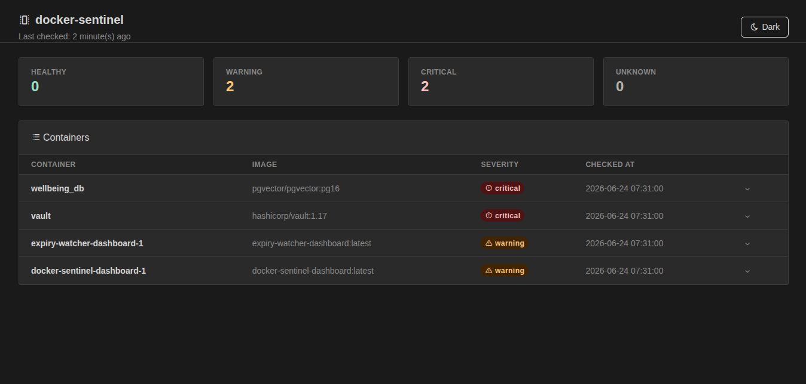

# docker-sentinel



[](https://github.com/igalhub/docker-sentinel/actions/workflows/ci.yml)

A lightweight container health monitor that detects the Docker containers
`docker ps` shows as "running" but are silently broken.

> **What this is:** A standalone monitoring tool, not a replacement for
> a full observability stack. It covers the gap between "container is up"
> (what Docker tells you) and "container is actually healthy" (what you
> need to know). If you already run Prometheus + cAdvisor + Grafana,
> you likely don't need this. If you run a handful of containers on a
> VPS or homelab without a full monitoring stack, this is for you.

---

## The problem

A container being "Up" in Docker's view means exactly one thing: the
process didn't exit. It doesn't mean:

- The process is responding to requests
- It's doing any work (logs could be silent for hours)
- Its built-in healthcheck is passing
- It hasn't been restarting every 30 seconds
- The port it's supposed to serve is actually open

All of these can be broken while `docker ps` shows "Up 2 hours."

---

## What docker-sentinel detects

### Category 1 — Crash-loop / lifecycle

| Problem | Signal |
|---|---|
| Crash-loop restart | High RestartCount AND short uptime — container exits and Docker keeps restarting it |
| Frequent unplanned restarts | RestartCount above threshold even if currently stable |
| Short-lived container | Uptime below threshold at check time |

### Category 2 — Docker healthcheck

| Problem | Signal |
|---|---|
| Container marked `unhealthy` | Docker's own HEALTHCHECK is failing — process is up but not serving correctly |
| Container stuck in `starting` | HEALTHCHECK never passed since the container started |
| No HEALTHCHECK defined | Best-practice gap — not a failure, but worth knowing |

### Category 3 — Port responsiveness

| Problem | Signal |
|---|---|
| Port not accepting connections | TCP connect to an exposed port fails or times out |
| Port responding slowly | TCP connect succeeds but takes longer than the warning threshold |

Containers with no exposed ports are noted but not flagged — internal
services (databases, background workers) legitimately have no published
ports.

### Category 4 — Log activity

| Problem | Signal |
|---|---|
| Silent container | No log output in the last N hours |

This is a binary check (any output vs no output), not log parsing.
Reliable error detection across arbitrary log formats would require
per-container configuration — deferred to v2.

---

## What docker-sentinel does NOT detect

Being explicit about scope is part of the design:

- **Application-level errors** — a web server returning 500s to every
  request looks perfectly healthy from the outside. The tool sees the
  container runtime, not what's inside it.
- **Data corruption** — no visibility into what a container wrote to
  a volume.
- **Network routing between containers** — can check if a port accepts
  a TCP connection, not if the container correctly routes to other
  services.
- **Security vulnerabilities** — different tool category entirely
  (Trivy, Snyk, etc.).
- **Resource trends (CPU/memory)** — point-in-time CPU/memory is
  nearly meaningless; trend detection requires multiple data points
  over time. Deferred to v2 — the SQLite schema stores history to
  support this.
- **Log error detection** — "last log line contains ERROR" is ambiguous
  across arbitrary log formats. Deferred to v2.

---

## Severity thresholds (defaults, all configurable)

Edit `config/settings.yaml` to adjust any threshold.

| Check | Warning | Critical |
|---|---|---|
| RestartCount | > 3 | > 10 |
| Uptime at check time | < 5 minutes | < 60 seconds |
| Healthcheck status | `starting` for > 5 min | `unhealthy` |
| Port response time | > 2 seconds | connection refused / timeout |
| Log silence | > 2 hours | > 6 hours |
| No HEALTHCHECK defined | warning | — |

A container's overall severity is the **worst** of all individual check
results. A container that passes restart/uptime checks but has a closed
port is `critical`.

---

## Architecture

```
systemd timer (every 5 minutes)
  └── python -m checker.check
        └── docker_checker.py (docker-py SDK)
              ├── lists all running containers
              └── per container:
                    ├── restart_check()      — RestartCount + uptime
                    ├── healthcheck_check()  — Docker health status
                    ├── port_check()         — TCP connect to exposed ports
                    └── log_activity_check() — any output in last N hours?
              └── writes results → results.db (SQLite)

FastAPI dashboard (separate process)
  └── READ-ONLY against results.db
        ├── GET /status  → JSON: per-container aggregate + per-check breakdown
        └── GET /        → HTML table, color-coded by severity,
                           per-check detail, staleness indicator,
                           dark/light mode toggle
```

The dashboard defaults to dark mode. Use the toggle button in the top right to switch to
light mode — the preference is saved in `localStorage`.

**Why two processes?** The checker and dashboard are deliberately
separate. A dashboard crash doesn't stop checks from running. A checker
failure doesn't take down visibility into the last-known state. If the
checker stops running, the dashboard surfaces its own data as stale —
a monitoring tool that can't detect its own staleness isn't a monitoring
tool.

**Why docker-py SDK, not the Docker CLI?**
`docker-py` connects directly to the Docker socket via the official API.
No subprocess overhead, no CLI parsing, no shell injection risk. All
inspect/logs calls return typed Python objects, not strings to parse.

---

## Stack

- **docker-py** — Docker SDK for Python, container inspection and logs
- **FastAPI + uvicorn** — read-only dashboard
- **SQLite** — persists check results with timestamps
- **systemd timer** — schedules checks every 5 minutes
- **pytest** — test suite with live Docker fixtures for each failure mode

---

## Setup

**Prerequisites:** Python 3.12, Docker running locally, user in the
`docker` group (or root).

> **Warning:** Membership in the `docker` group is equivalent to root
> access on the host — it grants unrestricted access to the Docker
> socket, which can be used to mount the host filesystem into a
> container and escalate from there. Don't grant it casually,
> especially on a shared or internet-facing box.

```bash
git clone git@github.com:igalhub/docker-sentinel.git
cd docker-sentinel
python3 -m venv .venv
source .venv/bin/activate
pip install -r requirements.txt
```

### Configure

```bash
cp config/settings.yaml.example config/settings.yaml
# Edit config/settings.yaml to adjust thresholds if needed
# Defaults are reasonable for most setups
```

### Install the systemd timer (Linux only)

```bash
bash systemd/install.sh
```

Copies `docker-sentinel.service` and `docker-sentinel.timer` to
`~/.config/systemd/user/`, reloads the daemon, enables and starts
the timer. Checker runs 2 minutes after boot, then every 5 minutes.

### Run the checker manually

```bash
python -m checker.check
```

Note: must be invoked as `python -m checker.check` from the project
root — not `python checker/check.py`.

---

## Running the dashboard

Run the checker at least once first to create `results.db`.

**Docker (recommended):**

```bash
python -m checker.check
docker compose up dashboard
```

Dashboard at **http://localhost:8081** (host port configured in `docker-compose.yml` — change
`8081:8080` to `8080:8080` if that port is free on your machine).

**Direct:**

```bash
uvicorn dashboard.main:app --host 0.0.0.0 --port 8080
```

### Authentication

The dashboard has no built-in login by default — set
`SENTINEL_DASHBOARD_USER` and `SENTINEL_DASHBOARD_PASSWORD` to enable
HTTP Basic Auth on both `/` and `/status`:

```bash
export SENTINEL_DASHBOARD_USER=admin
export SENTINEL_DASHBOARD_PASSWORD=change-me
```

(Or uncomment the equivalent lines in `docker-compose.yml`.) Both must
be set together, or the dashboard refuses to start.

When auth is enabled, FastAPI's auto-generated `/docs`, `/redoc`, and
`/openapi.json` routes are disabled outright (they're registered outside
the app's own route handlers, so they can't be gated with the same
per-route auth check). With auth disabled, those routes stay enabled.

> **Do not expose the dashboard port directly to the internet**, even
> with Basic Auth enabled — credentials are base64-encoded, not
> encrypted, unless the connection is behind TLS. Put it behind a
> reverse proxy (Caddy, nginx, Traefik) with TLS, or restrict access to
> a VPN/private network.

The dashboard itself does not rate-limit or lock out failed Basic Auth
attempts — that's the reverse proxy's job too. Configure rate limiting
there (e.g. Caddy's `rate_limit`, nginx's `limit_req`, or Traefik's
`RateLimit` middleware) if the dashboard is reachable by anyone other
than you.

---

## Running tests

Install dev dependencies first: `pip install -r requirements-dev.txt`.

**Offline suite (no Docker daemon required):**

```bash
pytest -m "not docker" -v
```

**Live Docker tests** (requires Docker daemon and permission to create
containers):

```bash
pytest -m docker -v
```

Live tests create real containers as fixtures — a crash-looping container
(exits immediately), a container with a failing HEALTHCHECK, and a
container with a closed port — and confirm the detector fires correctly
on each. Fixtures are cleaned up after each test.

**What CI actually runs, in order:**

```bash
ruff check .
pytest -m "not docker" -v --cov=checker --cov=dashboard --cov-fail-under=96
```

---

## Platform support

| Component | Linux | macOS | Windows |
|---|---|---|---|
| Checker | Tested | Likely works (Docker Desktop socket path may differ) | Likely works via WSL2, untested |
| Dashboard | Tested | Likely works | Likely works via WSL2, untested |
| systemd timer | Tested | Not supported (use cron) | Not supported |

**macOS note:** Docker Desktop on Mac uses a different socket path than
Linux (`~/.docker/run/docker.sock` vs `/var/run/docker.sock`). `docker-py`'s
`docker.from_env()` respects the `DOCKER_HOST` environment variable and
the Docker context, so it should work automatically — but this hasn't
been tested on real Mac hardware.

**Home lab (Proxmox VE + Ubuntu Server 24.04.3 VM):** Fully tested —
all components work as-is, including the Docker socket path
(`/var/run/docker.sock` — same as desktop Linux, no configuration
needed). Note that `python3.12-venv` must be installed explicitly
(`sudo apt install -y python3.12-venv`). See
`docs/HOMELAB_DEPLOYMENT.md` for the full walkthrough.

---

## What's not in v1

**Resource monitoring (CPU/memory trends):** point-in-time resource
usage is nearly meaningless; detecting trends requires multiple data
points over time. The SQLite schema stores history from day one to
support this in v2, but the checker logic is meaningfully more complex.
Tracked as DS-stretch-01.

**Log error detection:** "last log line contains ERROR" sounds simple
but log formats vary wildly. Reliable detection requires per-container
parser configuration. Tracked as DS-stretch-02.

**Multi-host / Swarm / Kubernetes:** monitors the local Docker daemon
only. Kubernetes has its own health check ecosystem (liveness/readiness
probes, pod restart counts) that would need a dedicated integration.
Tracked as DS-stretch-03.

**Push notifications (email, Slack, PagerDuty):** dashboard-only in v1.
The `/status` JSON endpoint is machine-readable and can be polled by any
external alerting system. Tracked as DS-stretch-04.

---

## Related projects

- **[Vault Secrets Demo](https://github.com/igalhub/vault-secrets-demo)**
  — secrets management pattern using HashiCorp Vault and AppRole auth
- **[Expiry Watcher](https://github.com/igalhub/expiry-watcher)** —
  TLS certificate, local cert file, and Vault credential expiry monitoring

Together these three tools cover the two main classes of silent
infrastructure failure: **credentials and certificates expiring** and
**containers running but broken**.

---

## License

[MIT](LICENSE) — free to use, modify, and distribute.

---

*Built by [Igal](https://github.com/igalhub) as part of a DevOps
portfolio — actively looking for DevOps / SRE / platform engineering
roles.*
